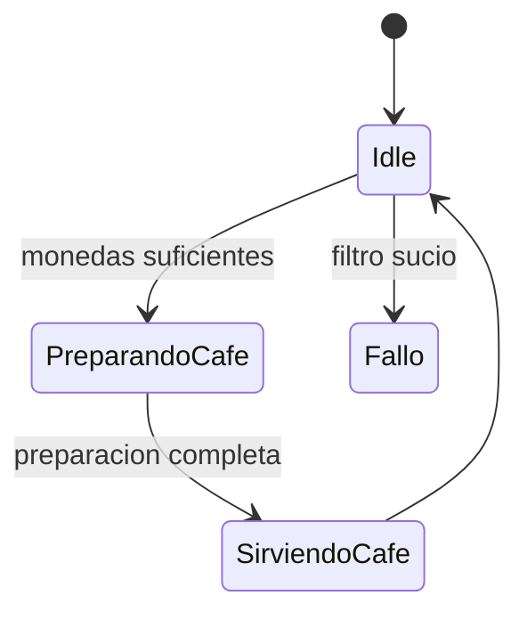

# ☕ Máquina de Café - Un Proyecto en Kotlin ☕

¡Bienvenido a mi pequeño proyecto de una máquina de café! 🌟 Este es un ejemplo sencillo para demostrar cómo funciona una máquina de estados en Kotlin.

## 🚀 Clases del Proyecto

Aquí tienes un resumen de las clases que hacen la magia posible:
### Clases Necesarias 
Son las clases necesarias para hacer las pruebas
#### `Main.kt` ▶️

El punto de entrada de la aplicación. Aquí es donde creamos un café y le pedimos a nuestra `MaquinaCafe` que se ponga a trabajar. Aquí hacemos pruebas con los posibles estados y el funcionamiento del filtro.

#### `MaquinaCafe.kt` 🤖

Este es el cerebro de la operación. Se trata de un `object` (un Singleton) que representa nuestra máquina de café. Gestiona el estado actual, el filtro (que se ensucia tras 10 cafés) y el contador de cafés hechos. Controla las transiciones de estado mediante la función `transicionValida`, que verifica condiciones como dinero suficiente y filtro limpio. Si el filtro está sucio, la máquina pasa automáticamente a estado de fallo.

#### `EstadosMaquinas.kt`🚦

Aquí es donde se definen los posibles estados de nuestra máquina. Usando una `sealed class`, nos aseguramos de que solo puedan existir los siguientes estados:

-   `Idle`: La máquina está esperando a que alguien pida un café. 😴
-   `PreparandoCafe`: La máquina está en proceso de preparación. 👨‍🍳
-   `SirviendoCafe`: ¡El café está listo y se está sirviendo! ☕
-   `Fallo`: Algo ha salido mal (por ejemplo, filtro sucio). 😱
Cada estado implementa su lógica de entrada (`onEnter`).

### Clases extra
Para hacer algo más complejo si se quiere (puse a futuro pero ya lo implementé), si quieres hacer algo más complejo, aquí implementé más cosas, que el estado para hacer pruebas más complejas porque me apeteció, no son estrictamente necesarias para la tarea pero las implementé junto a las otras, para hacer cosas algo más avanzadas
#### `Cafe.kt` 📝

Una `data class` muy simple que representa un café. Contiene propiedades como:

-   `precio`: ¿Cuánto cuesta? 💰
-   `cantidadAzucar`: ¿Lo quieres dulce? 🍬
-   `tipo`: El tipo de café (definido en `TiposCafe`).

#### `TiposCafe.kt` 📋

Un `enum` que define los tipos de café que nuestra máquina puede preparar. Por ahora, tenemos:

-   `CAPPUCCINO`
-   `DESCAFEINADO`
-   `CHOCOLATE`

---

🛠️ **Lógica principal:**
- El filtro se ensucia automáticamente tras 10 cafés servidos, bloqueando nuevas preparaciones hasta que se limpie.
- Las transiciones de estado están controladas por la función `transicionValida`, que verifica condiciones como dinero suficiente y filtro limpio.
- Si el filtro está sucio, la máquina pasa automáticamente al estado `Fallo` con el mensaje correspondiente.
- El método principal para interactuar es `hacerCafe`, que gestiona el flujo completo de preparación.

Y eso es todo, aquí está explicado el flujo de ejecución en la máquina de estado. Ahora la lógica es más robusta y realista, permitiendo simular fallos y el mantenimiento del filtro de forma sencilla y clara. Si quieres hacer algo más complejo, puedes modificar los estados o añadir nuevos tipos de café fácilmente. ☕🚦🤖
## 📊 Diagrama de Estado
Aqui se puede ver una muestra de mi diagrama de estado, ya lo tenia hecho en clase tanto el diagrama de estado como el codigo así que aproveche a digitalizarlo

